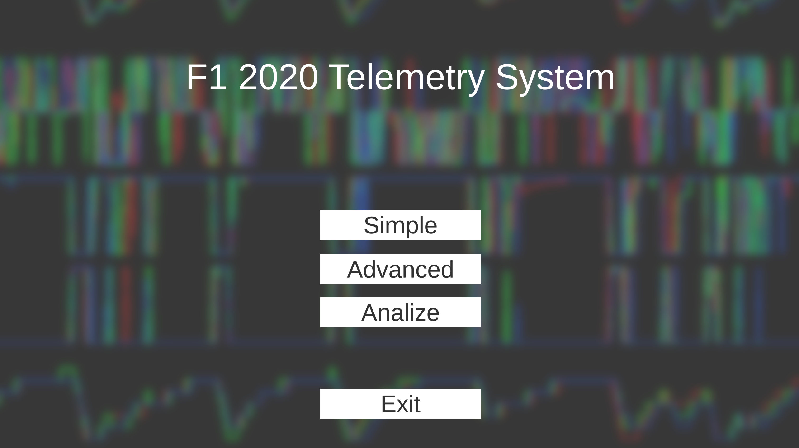
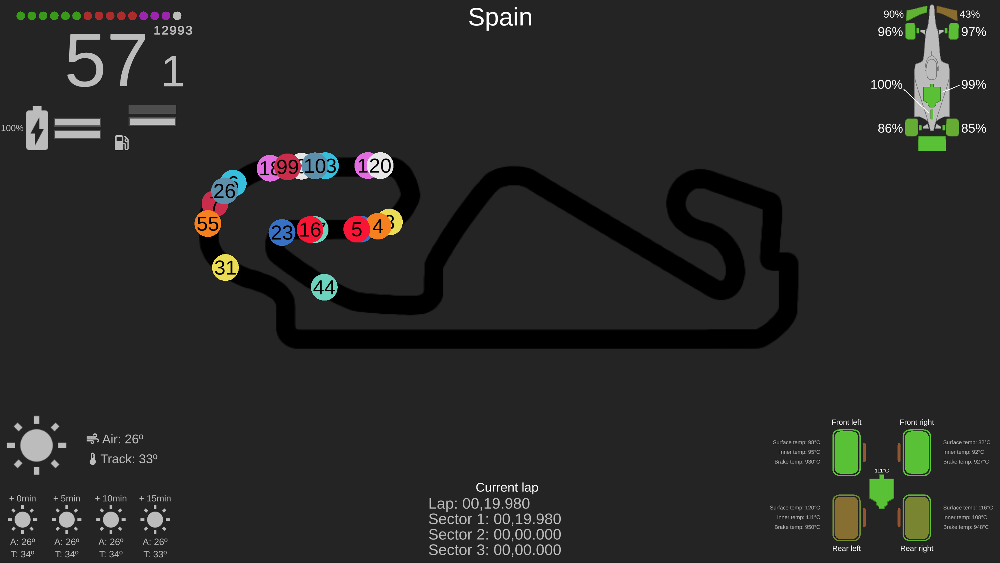
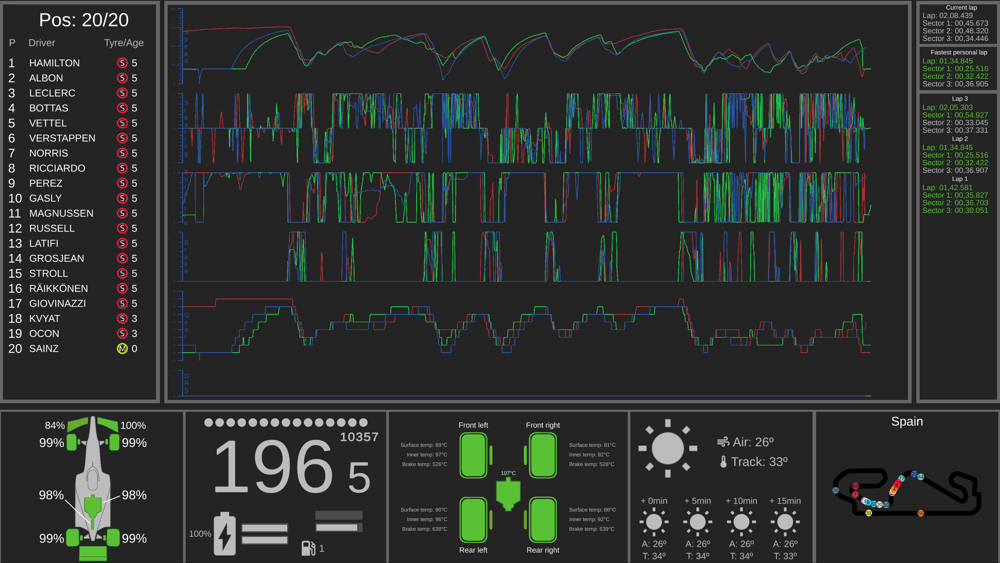

# F1 2020 Telemetry System 2020

Welcome to my F1 2020 telemetry system. This is a simple, low resource and open source app that allows you to visually analise telemetry data directly 
extracted from the official F1 2020 game made by Codemasters. For the extraction of the data, I've used my own library called [F1TS Library](https://github.com/JuanmaSalva/F12020TelemetryLibrary).

I am currently working on the app so don't expect a finished and polished product, yes I know that it's 2022 and this game is 2 generations old, the point of this app is that once it's completed, in order
to adapt it to a newer games, I should only need to change the library in use depending of the game. I would still need to adapt the library to make this work, 
but it would take me a couple of weeks to do it instead of years making a completely new app. (I am doing this at my free times so that's why it's taking me so long).

As I'm still working, in this repository I have a Unity project and a build. If you use the build, bare in mind that once you launch the app, it will open the default
socket established by the game (20777) and it will not close it until you hit the "Exit button" on the main menu.

###Use case
Once you open the app, you will be welcome by my (not) beautiful menu. Here you have there options, or you will have, at the moment only the "Advanced" and "Simple"
mode are "completed".

####Simple Mode
This is a mode to use mainly during a race. You have your dash, the car damage/wear, general temperatures, the current lap, the weather and most 
importantly, the race track with the positions of all cars. You can see the data you want
with a quick glince without losing the focus on the game.

 

####Advanced Mode
This mode is thought to use in qualifying. The main focus of this mode is the graph in the middle. In this graph you can see your fastest lap (red),
your previous lap (green), and your current lap (blue). You also have the full standings with information of the tyres of each car, the dash, the car damage/wear, 
general temperatures, the current lap, fastest lap and lap history, the weather and the track map with each car.

####Analyze mode
 Not done yet, but the idea is that it will be a mode to use between sessions. The entire screen will be fulled by a similar graph used in the Advanced
 mode. On this graph you will be able to load and compare a lap to another lap making zoom and analyzing each part of the track in detail. As each lap
 will be saved on individuals files, there will be the option to share your lap with other people and try to improve everyone at the same time.

Obviously, all modes are compatible with each type of session. You can perfectly use the simple mode in quilting and the advanced mode during a race.

###Instructions to use
The controls are basic, once your are in a mode, you can exit it by pressing esc. It will also exit to the main menu automatically when a session ends.
Once you are in a mode, the app is reading data from the game, so you can go on and start a session. All the information will not update until the session
actually starts (aka, you start racing).
Before launching the app make sure to use the last build and enable the telemetry usage inside the game. It is very import to make sure that when you
enable the telemetry inside the game, it is set to de 20777 port, which is the default one, but check it just in case.

###Important information
This is not a beta, it's not even an alpha, it's les than that! I would call it a prototype. I started this for fun but it's resulting in something that
with a bit (quite a lot) more work, it could actually be something useful. There are plenty of bugs and crashes, as the months go by, there should be less
and less of them.